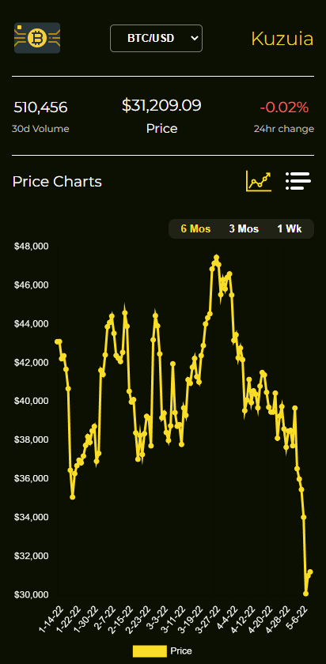
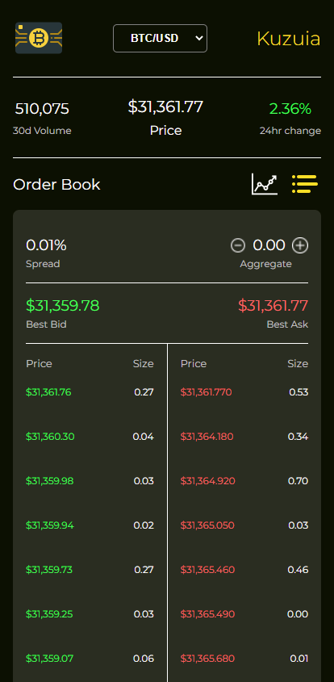

# Kuzuia | A Live Crypto Tracker

Kuzuia, which means Block in Swahili, is a real-time cryptocurrency tracker that is capable of displaying live data for over 170 currency pairs. Kuzuia allows users to gather consolidated market information in order to make trading decisions.

https://kuzuia.netlify.app/

By Enrique Barco

## How  it works...

Users are prompted to select a currency on the landing page.


Market information is then displayed - which includes a live orderbook and a price chart, along with important ticker information such as 30d volume, price, and 24hr change %.


Users can modify the price chart widget by selecting the timeframe. Options include 6 months, 3 months, and 1 week.



Users can modify the order book widget by aggregating the pricing of the asks/bids. Options include 0.00 (no aggregation), 0.01, 0.05, 0.10, 0.50, 1.00, 2.50, 5.00, and 10.00




## Local Installation and Deployment

As simple as creating a clone and running NPM install & start

```bash
git clone <your-forked-repo>
npm install
npm start
```

## Tech Stack
Built on JavaScript & Sass, leveraging CoinBase API (REST API & WebSocket). Deployed on Netlify
